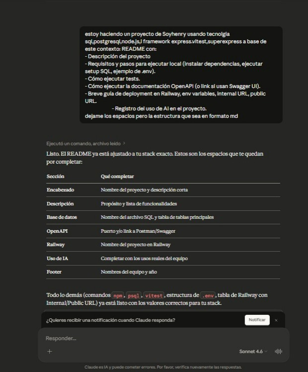
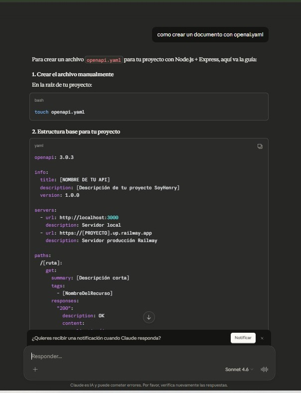
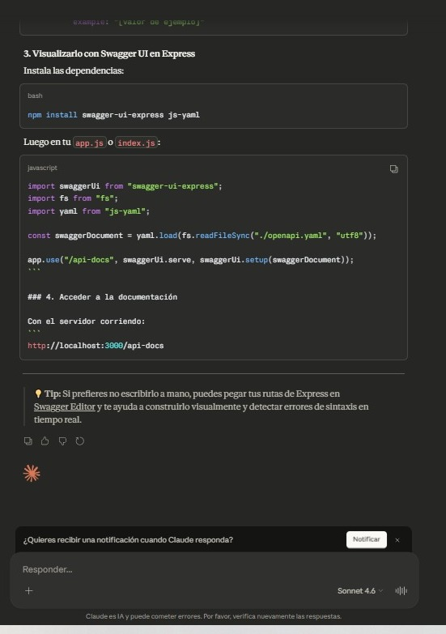
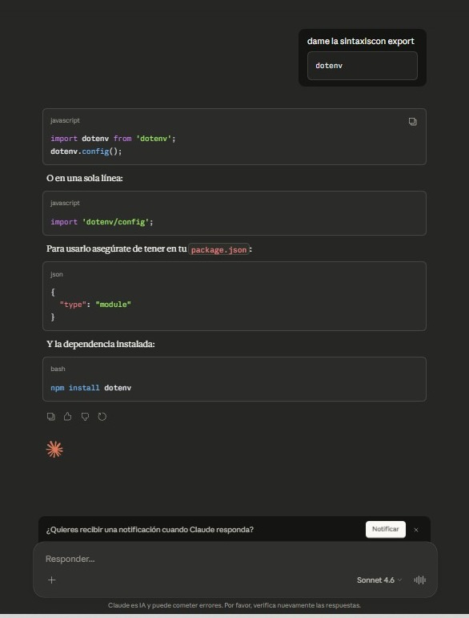

# 📦 API Mini Blog

> API Para administar authores y Posts

---
## 📝 Descripción

Esta es una API con la capacidad de mirar los authores y sus respectivos posts ,con la posibilidad de hacer posts tambien

**Funcionalidades principales:**

- Capacidad de ver authores y sus post
- Crear post 
- Crear authors

---

## ⚙️ Requisitos

Asegúrate de tener instalado lo siguiente antes de comenzar:

| Herramienta  | Versión mínima recomendada |
| ------------ | -------------------------- |
| Node.js      | v24.13.0                   |
| npm          | incluido con Node.js       |
| PostgreSQL   | 15+                        |
| Git          | cualquiera reciente        |

---

## 🚀 Instalación y ejecución local

### 1. Clonar el repositorio

```bash
git clone https://github.com/Taimolrvz007/ProyectoM2_JosueKalethSalazar.git
cd [REPO]
```

### 2. Instalar dependencias

```bash
npm install
```

### 3. Configurar variables de entorno

```bash
cp .env.example .env
# Edita .env con tus valores locales
```


### 4. Configurar la base de datos

```bash
# Crear la base de datos
createdb [NOMBRE_DB]

# Ejecutar el script de setup
psql -U [USUARIO] -d [NOMBRE_DB] -f setup.sql
```

### 5. Levantar el servidor

```bash
npm run dev     # desarrollo con hot-reload
npm start       # producción
```

Servidor disponible en: `http://localhost:3000`

---

## 🔐 Variables de entorno

Crea un archivo `.env` en la raíz del proyecto basándote en `.env.example`:

```env
# ── Servidor ───────────────────────────────────────
PORT=3000
NODE_ENV=development          # development | production

# ── Base de datos ──────────────────────────────────

DATABASE_URL=


> ⚠️ Nunca subas el archivo `.env` real al repositorio. Está incluido en `.gitignore`.

---

## 🗄️ Base de datos

El archivo `setup.sql` contiene la estructura inicial de la base de datos (tablas, índices, constraints).

```bash
psql -U [USUARIO] -d [NOMBRE_DB] -f setup.sql
```

---

## 🧪 Ejecutar tests

El proyecto usa **Vitest** y **Supertest** para los tests de integración.

```bash
# Todos los tests
npm test

# Con reporte de cobertura
npm run test:coverage
```

---

## 📖 Documentación OpenAPI

Con el servidor corriendo, accede a la documentación Swagger UI en:

```
https://proyectom2josuekalethsalazar-production.up.railway.app/api-docs/
```

O bien, consulta la colección externa aquí:

📎 [Ver colección en Thunder client / Swagger](https://proyectom2josuekalethsalazar-production.up.railway.app/api-docs/)

---

## 🚂 Deployment en Railway

### Pasos

1. **Crear el proyecto**
   - Ir a [railway.app](https://railway.app) → *New Project* → *Deploy from GitHub repo*
   - Seleccionar este repositorio y la rama `main`

2. **Agregar base de datos PostgreSQL**
   - Dentro del proyecto → *New Service* → *Database* → *PostgreSQL*
   - Railway provisiona automáticamente las credenciales

3. **Configurar variables de entorno**
   - Servicio de la app → pestaña *Variables* → agregar cada clave

   | Variable      | Valor en Railway                               |
   | ------------- | ---------------------------------------------- |
   | `PORT`        | Railway lo asigna automáticamente              |
   | `NODE_ENV`    | `production`                                   |
   | `DATABASE_URL`| **Internal URL** del servicio PostgreSQL       |
   

4. **Deploy**
   - Railway hace deploy automático en cada push a `main`
   - También puedes forzarlo desde: panel del servicio → *Deploy*

### Verificar el deployment

```bash
curl proyectom2josuekalethsalazar-production.up.railway.app
# Esperado: { "status": "ok" }
```

---

## 🤖 Uso de IA en el proyecto
### Claud fue usada para la creacion de la documentacion


### Claud para preguntar la documentacion y como crearlo OpenApi.yaml




### aca le pregunte sobre la sintaxis basica de DOTENV


---

<p align="center">
  Proyecto desarrollado en <strong>SoyHenry</strong> · Josue Kaleth Salazar · 
</p>